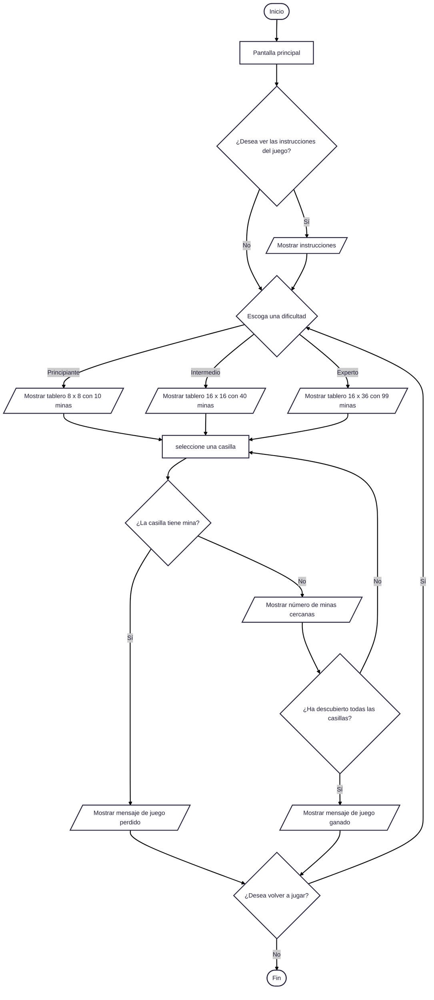

# Proyecto-Codecraft-Buscaminas

## Mine Hunter 3000 🥊💣💥

## Introducción
### *¿En qué consiste el juego de Buscaminas?*

Buscaminas es un videojuego clásico de lógica y estrategia, comúnmente jugado en computadoras personales. El juego se desarrolla sobre una cuadrícula compuesta por varias casillas, algunas de las cuales esconden minas. 

El objetivo principal del jugador es descubrir todas las casillas que no contienen minas, evitando detonarlas. Para lograrlo, el jugador hace clic en las casillas, y si la casilla no contiene una mina, revela un número. Este número indica cuántas minas se encuentran en las casillas adyacentes (es decir, en las ocho celdas que rodean a la seleccionada). 

A partir de esta información, el jugador debe deducir la ubicación de las minas y puede marcar las casillas sospechosas con banderas, lo cual sirve como ayuda visual para no hacer clic en ellas accidentalmente. 

El juego se gana al descubrir correctamente todas las casillas libres de minas. Por el contrario, se pierde si el jugador selecciona una casilla que contiene una mina.

## Objetivos
### *Objetivo general*

Presentar y desarrollar un juego interactivo de Buscaminas que combine lógica, estrategia y entretenimiento, implementando una interfaz intuitiva que facilite al usuario la toma de decisiones basadas en pistas numéricas para descubrir las celdas seguras, evitando las minas ocultas y completando el desafío dentro de una experiencia funcional y accesible.

### *Objetivos específicos*

1. Desarrollar una interfaz intuitiva que permita al usuario interactuar con el juego mediante clics, como el marcar o reiniciar juego.
2. Diseñar la estructura del tablero y establecer la lógica de distribución aleatoria de minas según los diferentes niveles de dificultad.
3. Implementar un sistema que calcule y muestre correctamente la cantidad de minas cercanas a cada celda descubierta.
4. Incorporar elementos visuales para aquellas acciones clave que el jugador realiza como: marcar mina(mediante un símbolo de bandera), descubrir celda, ganar o perder.
5. Poner en práctica todos los conocimientos adquiridos durante el curso programación de computadores.

## *Lógica del juego*

- Mostrar pantalla principal.
- Preguntar al usuario si desea ver las instrucciones:
    Si elige "Sí", mostrar texto con las reglas del juego.
    Si elige "No", Seguir con el siguiente proceso.
- Continuar con la selección de dificultad.
- Preguntar al usuario qué dificultad desea:
    -> Principiante -> tablero 8x8, 10 minas.
    -> Intermedio -> tablero 16x16, 40 minas.
    -> Experto -> tablero 16x36, 99 minas.
- Generar el tablero vacío y colocar minas de forma aleatoria.
- El jugador selecciona una casilla.
- Evaluar la casilla:
    -> Si tiene una mina:
        - Mostrar mensaje de “Juego perdido”.
        - Ofrecer opción de volver a jugar.
    -> Si no tiene una mina:
        - Calcular y mostrar el número de minas vecinas.
- Luego de cada jugada:
    Verificar si todas las casillas sin mina han sido descubiertas.
        -> Si sí, mostrar mensaje de “¡Has ganado!”.
        -> Si no, esperar el siguiente clic.
- Tras ganar o perder:
    -> Preguntar al jugador si desea volver a jugar.
        -> Si elige Sí, reiniciar desde selección de dificultad.
        -> Si elige No,cerrar el juego.

## *Interfaz grafica*
### Pygame
- librería para el desarrollo de videojuegos en segunda dimensión 2D con el lenguaje de programación Python. Pygame está basada en SDL, que es una librería que nos provee acceso de bajo nivel al audio, teclado, ratón y al hardware gráfico de nuestro ordenador.

_Ventajas_
- Función main() o clase Game(): contenedor del videojuego.
- Control de eventos: pygame.event.get(), es decir, lista de eventos a procesar.
- Sprites: rectángulos que representan los objetos móviles o fijos del juego. Estos pueden animarse con frames o modificarse gráficamente. También se pueden detectar colisiones pygame entre ellos.
- Sonidos: pygame.mixer.Sound() y play.
- Textos: pygame.font.Font(file_path, size) y render.

### tkinter
- Módulo estándar de Python para crear interfaces gráficas de usuario (GUI). Es un "binding" de la biblioteca Tcl/Tk, lo que significa que permite usar las funcionalidades de Tk desde Python.

_Ventajas_
- Crea interfaces gráficas de usuario de forma rápida y eficiente, lo que es útil para aplicaciones de escritorio y otras herramientas. 
- Es conocido por ser relativamente sencillo de aprender y usar.

En nuestro proyecto utilizaremos pygame ya que trae más herramientas y genera una interfaz grafica de mayor calidad, permitiendonos editar detalles con el fin de obtener un resultado más estetico.

## *Diagrama de flujo del juego*

## Plan de desarrollo
### Cronograma

|  Semana  |          Fecha          | Tema                                                                                           |
|----------|-------------------------|------------------------------------------------------------------------------------------------|
| Semana 10| 09/06/2025 - 15/06/2025 | ✅ Diseño del preproyecto: ideas del juego, reglas, diagramas de flujo                         |
| Semana 11| 16/06/2025 - 22/06/2025 | 📋 Revisión de avances: presentación del diagramas de flujo y retroalimentación del profesor   |
| Semana 12| 23/06/2025 - 29/06/2025 | 🧠 Estructura base del juego: lógica, funciones principales, etc                               |
| Semana 13| 30/07/2025 - 06/07/2025 | 🐞 Depuración y validación: comprobar que el buscaminas funcione bien                          |
| Semana 14| 07/07/2025 - 13/07/2025 | 🎨 Inicio de interfaz gráfica con tkinter o pygame                                             |
| Semana 15| 14/07/2025 - 20/07/2025 | 🧪 Integración y pruebas: conectar lógica + interfaz                                           |
| Semana 16| 21/07/2025 - 27/07/2025 | 🧾 Presentación final del proyecto: mostrar funcionalidades completas y exponer                | 

## Menú del juego:
El menú principal es la pantalla inicial del juego desde donde el jugador puede acceder a las diferentes funciones antes de comenzar a jugar.

En el menú del juego se presentan dos opciones principales: ‘Continuar’ e ‘Instrucciones’. La opción ‘Continuar’ permite acceder a los diferentes niveles de dificultad que ofrece el juego, mientras que la opción ‘Instrucciones’ proporciona una guía con las indicaciones necesarias para aprender a jugar Mine Hunter 3000.
[Mine-1.png](https://postimg.cc/MMtWJmvd)

# Autores:
- [Brayan Santiago Rincón Rodríguez](https://github.com/santiagorinconrodriguez)
- [Nelson Manuel Amaya Diaz](https://github.com/ingnelama)
- [Sebastian Carvajal Rojas](https://github.com/sebascarvajalr)
